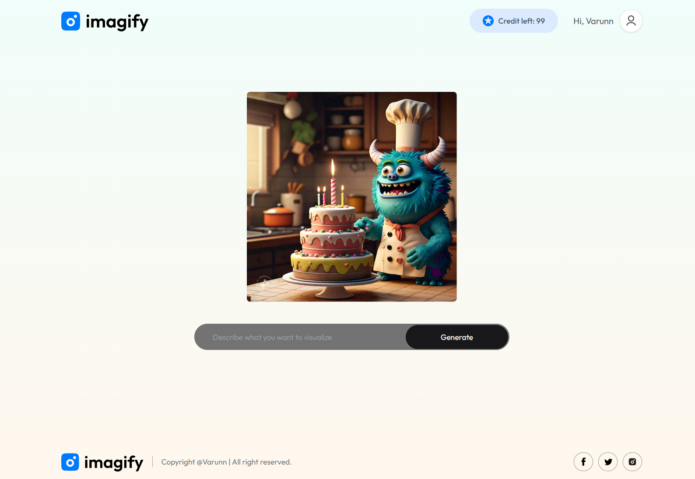

# Imagen - AI Text-to-Image Generator

A modern web application that generates stunning visual art from text descriptions using AI. Built with React, Node.js, and MongoDB.

## 📸 Screenshots

### Homepage


### Image Generation Page


### Pricing Page


### Sample Generated Images


## 🚀 Features

- **AI-Powered Image Generation**: Convert text descriptions into beautiful images
- **User Authentication**: Secure login and registration system
- **Credit System**: Manage usage with a credit-based system
- **Real-time Generation**: Watch your images come to life in seconds
- **Download Images**: Save generated images to your device
- **Responsive Design**: Works seamlessly on desktop and mobile devices
- **Modern UI**: Beautiful, intuitive interface with smooth animations

## 🛠️ Tech Stack

### Frontend
- **React 19** - Modern React with hooks and context
- **Vite** - Fast build tool and development server
- **Tailwind CSS** - Utility-first CSS framework
- **Framer Motion** - Smooth animations and transitions
- **React Router DOM** - Client-side routing
- **React Toastify** - Toast notifications
- **Axios** - HTTP client for API requests

### Backend
- **Node.js** - JavaScript runtime
- **Express.js** - Web application framework
- **MongoDB** - NoSQL database
- **Mongoose** - MongoDB object modeling
- **JWT** - JSON Web Tokens for authentication
- **bcrypt** - Password hashing
- **CORS** - Cross-origin resource sharing
- **dotenv** - Environment variable management

## 📁 Project Structure

```
imagen/
├── client/                 # Frontend React application
│   ├── src/
│   │   ├── components/     # Reusable UI components
│   │   ├── pages/         # Page components
│   │   ├── context/       # React context for state management
│   │   ├── assets/        # Static assets (images, icons)
│   │   └── App.jsx        # Main application component
│   ├── public/            # Public assets
│   └── package.json       # Frontend dependencies
├── server/                # Backend Node.js application
│   ├── controllers/       # Request handlers
│   ├── models/           # Database models
│   ├── routes/           # API routes
│   ├── middlewares/      # Custom middleware
│   ├── config/           # Configuration files
│   └── server.js         # Main server file
└── README.md             # Project documentation
```

## 🎨 UI Components & Assets

### Icons & Graphics
- **Logo**: Modern, clean logo design
- **Credit Star**: Icon for the credit system
- **Step Icons**: Visual guides for the user journey
- **Social Media Icons**: Facebook, Instagram, Twitter integration
- **UI Icons**: Email, lock, cross, download, and profile icons

### Sample Generated Images
The application showcases high-quality AI-generated images that demonstrate the power of the text-to-image generation capabilities.

## 🚀 Getting Started

### Prerequisites

- Node.js (v16 or higher)
- MongoDB (local or cloud instance)
- npm or yarn package manager

### Installation

1. **Clone the repository**
   ```bash
   git clone https://github.com/yourusername/imagen.git
   cd imagen
   ```

2. **Install frontend dependencies**
   ```bash
   cd client
   npm install
   ```

3. **Install backend dependencies**
   ```bash
   cd ../server
   npm install
   ```

4. **Environment Setup**

   Create a `.env` file in the server directory:
   ```env
   MONGODB_URI=mongodb://localhost:27017
   JWT_SECRET=your_jwt_secret_key_here
   PORT=4000
   ```

   Create a `.env` file in the client directory:
   ```env
   VITE_BACKEND_URL=http://localhost:4000
   ```

5. **Start the development servers**

   Start the backend server:
   ```bash
   cd server
   npm run server
   ```

   In a new terminal, start the frontend:
   ```bash
   cd client
   npm run dev
   ```

6. **Open your browser**
   - Frontend: http://localhost:5173
   - Backend API: http://localhost:4000

## 📖 Usage

1. **Register/Login**: Create an account or sign in to start generating images
2. **Enter Description**: Type a detailed description of the image you want to create
3. **Generate**: Click the "Generate Images" button and watch the magic happen
4. **Download**: Save your generated images to your device
5. **Manage Credits**: Purchase more credits when needed

## 🔧 API Endpoints

### Authentication
- `POST /api/user/register` - User registration
- `POST /api/user/login` - User login
- `GET /api/user/credits` - Get user credits (protected)

### Image Generation
- `POST /api/image/generate-image` - Generate image from text (protected)

## 🎨 Key Components

### Frontend Components
- **Header**: Main landing page with hero section
- **Navbar**: Navigation with user authentication and credit display
- **Result**: Image generation interface
- **Login**: Authentication modal
- **GenerateBtn**: Call-to-action button for image generation
- **BuyCredit**: Credit purchase page

### Backend Controllers
- **userController**: Handles user authentication and credit management
- **imageController**: Manages image generation requests

## 🔐 Security Features

- JWT-based authentication
- Password hashing with bcrypt
- Protected API routes
- CORS configuration
- Environment variable protection

## 💳 Credit System

- New users start with 5 free credits
- Each image generation costs 1 credit
- Users can purchase additional credits
- Credit balance is displayed in the navbar

## 🎯 Features in Detail

### Image Generation
- Real-time progress indication
- Error handling and user feedback
- Download functionality
- Generate multiple images from the same prompt

### User Experience
- Responsive design for all devices
- Smooth animations and transitions
- Toast notifications for user feedback
- Loading states and progress indicators

### State Management
- React Context for global state
- Persistent authentication with localStorage
- Real-time credit updates

## 🚀 Deployment

### Frontend Deployment (Vercel/Netlify)
1. Build the project: `npm run build`
2. Deploy the `dist` folder to your hosting platform

### Backend Deployment (Railway/Heroku)
1. Set environment variables in your hosting platform
2. Deploy the server directory
3. Update the frontend backend URL

## 🤝 Contributing

1. Fork the repository
2. Create a feature branch (`git checkout -b feature/AmazingFeature`)
3. Commit your changes (`git commit -m 'Add some AmazingFeature'`)
4. Push to the branch (`git push origin feature/AmazingFeature`)
5. Open a Pull Request

## 📝 License

This project is licensed under the MIT License - see the [LICENSE](LICENSE) file for details.

## 🙏 Acknowledgments

- React team for the amazing framework
- Tailwind CSS for the utility-first approach
- Framer Motion for smooth animations
- MongoDB for the database solution

## 📞 Support

If you have any questions or need help, please open an issue on GitHub or contact the development team.

---

**Made with ❤️ by [Your Name]**
